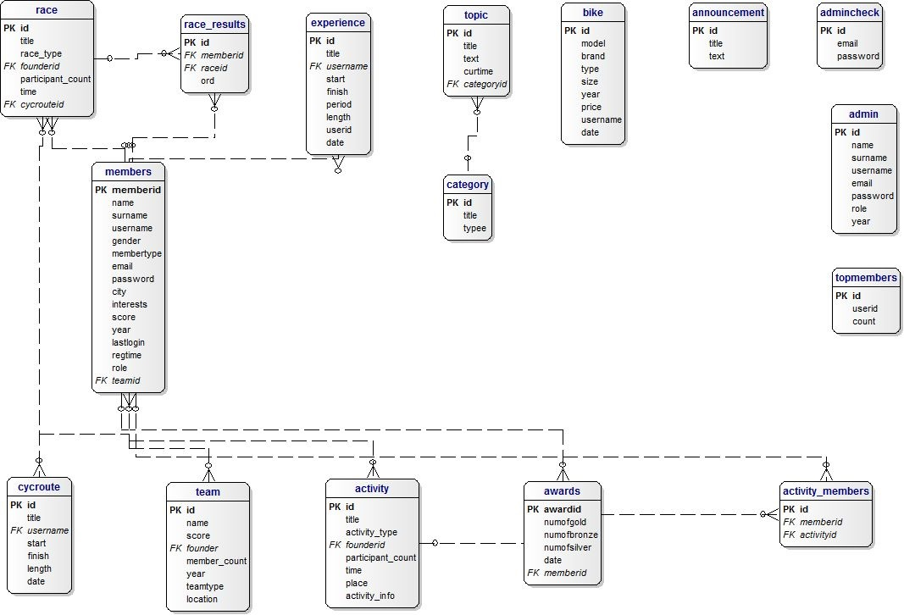

Developer Guide
===============
In this document we aimed to give developers detailed information about how our website works in background.

For our project, we need some classes. Basically these classes are listed as Activity, Race, Team, Admin, ProfessionalUser, BasicUser, Cycroutes, Experience, Bike, Forum, Announcement, Topic, Comment, News.

Database Design
---------------
We have 17 tables in our database. Some of them have foreign keys to each others which are represented in below figure.

**Entity - Relation ship Diagram of the Project**

.. toctree::

   member1
   member2
   member3
   member4
   
