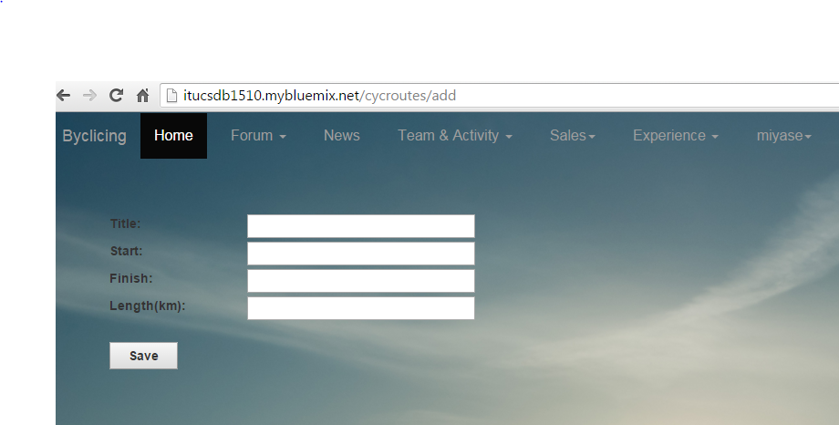
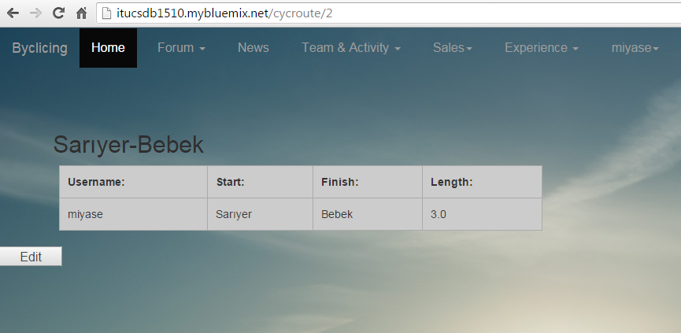
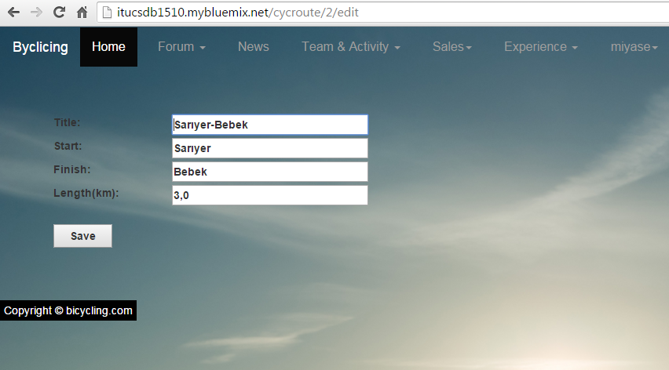
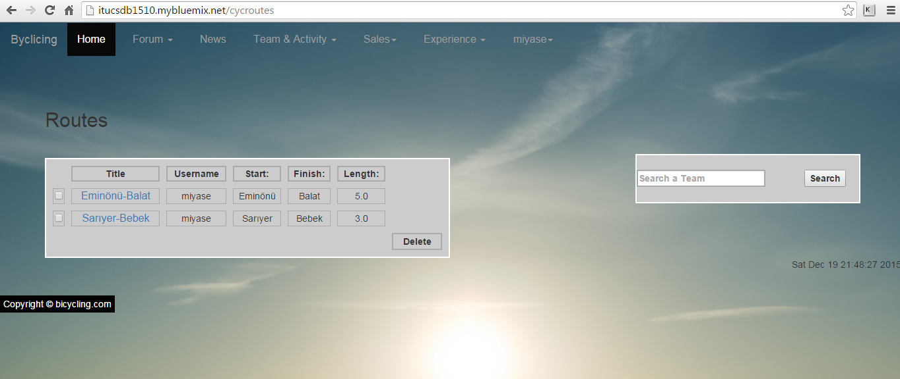
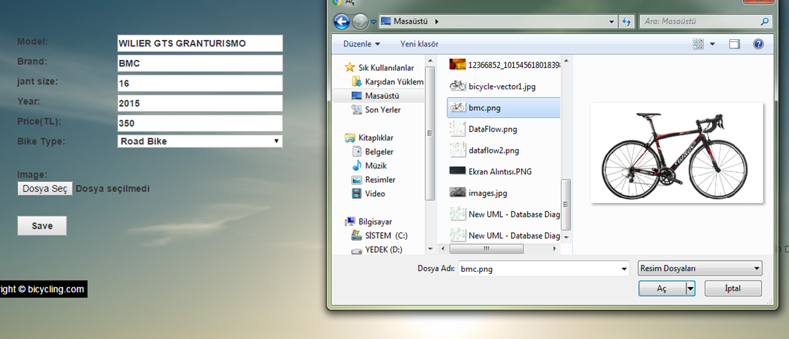
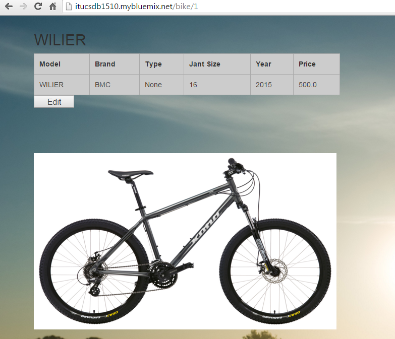
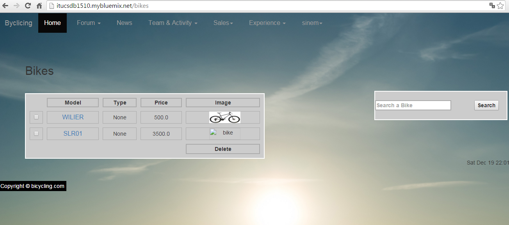
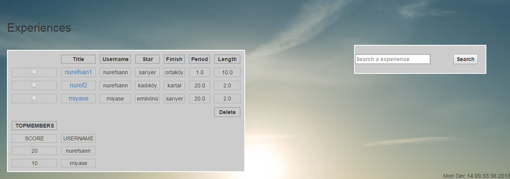

Parts Implemented by Miyase Tekpınar
================================
Route Pages
-------------
-The route form was prepared for admin that has authority to add new bcycle routes. Theese roads  are options for team race routes. 
If a team organize a race, founder of the team chooses one of them from dropdown menu. 

-Add route form:

   

-If the admin adds new route, the admin is redirected to the own page of new route to see in detail.

   
-Admin can edit routes.

   
   
-If the admin want to see all routes, he/she should click to list routes button from team&activity dropdown menu.

   
  
Bike Pages
-------------
-Users can put their own bikes up for sale. They must be fill up the form and add a photo.  

-Bike Page for each bike:

   
-All users can list bikes added by other users and click the model button to see in details.This button redirects to bike page.
-Edit authorization is given only the founder user of the bike that wanted to edit.
-If other users click the edit button, they will be redirected to login page.

   
Experience Pages
----------------
-Best non-professional users,that have experiences more than the others, enter TOPMEMBERS list.
-The list is prepared as a reference for admin to specify professional member candidates.

