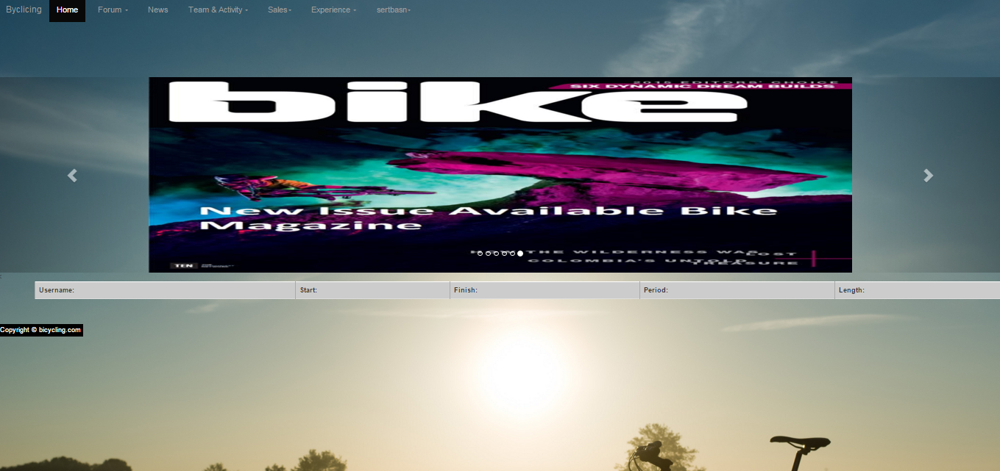

Parts Implemented by Nurefşan Sertbaş
=====================================
 The classes which are implemented by the developer are listed below:

  - Basic Member

  - Professional Member

  - Admin

 In order to  realization of the above classes some extra tables and structures are used which are listed below:

   -Awards table

   -Check admins table

 In this document, brief information will be given about the above classes from the user perspective.

Home Pages
----------
* When a person enter the website encountering website is given below. It is the interface that guest users should be faced.
 There exists general informationabout the developers and website concept on this page.

Guest Pages
-----------
* Guest have two option to select on this page such as login or signup. Also, making comment is served as an option.

* As can be stated above, names of the developers and name of the projects' consultant are given.

* If guest user already have an account, she/he can login with his/her account he/she should register first.
 Both cases are given in below figures.

* If guest user signup, he/she will be redirected to login page in order to reach the content of the website.

* Note that, there can be soma critical points:

   -If given email matches an email from the admin table user will be redirected to adminpanel directly.
   Else he/she will be considered as an professional or basic user. So, he/she would be redirected to home page.

   -If given email/ password does not match any record in database it redirected over login page again.

* The user which is trying to login with an admin email, should be redirected to adminpanel page if his/her password is correct.

User Pages
----------
* After email and password matches with database records, user will be redirected to home page.

* User can reach his/her messages and sales from the dropdown menu which was served to him/her.

Admin Pages
-----------
* If user login as an admin he/she would be redirected to admin panel which are represented below into two figures.

* Admin is allowed to add new admins. Only constraint is available admins are already strored in tha database.
 So current admin can only make their activation.

* All available admins are listed in below page (It is also available on 'List admins' link on the admin panel.).
 If admin wants to change or update some information it is enough to click on it. So that, related record is opened.
 Also, if admin wants to delete any record it should be selected from the checkbox which is located at the leftside of the record
 and should be pushed the delete button. Then, it will be deleted.

* Also, admin has authority to reach the basic/professional members' information and has authority to rearrenge the related contents.
 By this purpose admin can list all types of members independently from each other. For example, below screenshot is the list of basic members.
 As can be stated above, admin can update any information by clicking on the related record. Similarly, if admin wants to delete any record it should be selected from the checkbox which is located at the leftside of the record
 and should be pushed the delete button. Then, it will be deleted.

* The page that will be opened when admin clicks on from the previous page is respresented below.

