Parts Implemented by Esin Ersoğan
=================================

The admin and user interfaces are completed for below classes implemented:

  -  Team Page

  -  Race Page

  -  Activity Page

The object classes in the below are implemented:

  - Team

  - Race

  - Activity

Some extra sections written by this developer:

  - Members belong to a team are listed in the team page.

Team Pages
----------
  Team class has adding, editing, deleting, search, join this team operations.

  * Add Team Operation:

    A team can be added with filling the below form. Team type is selected from the options served with an dropdown menu.
  The current user's ID is selected by his/her username from the user session and assigned as the founder of the team.
  This team information is also inserted to the current user's TEAMID column into the member table.

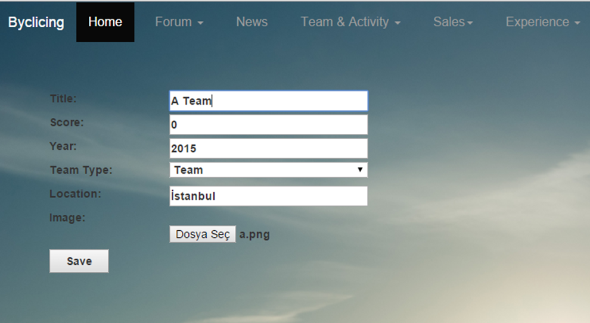
--

  * List Team

    All teams can be listed just like below.

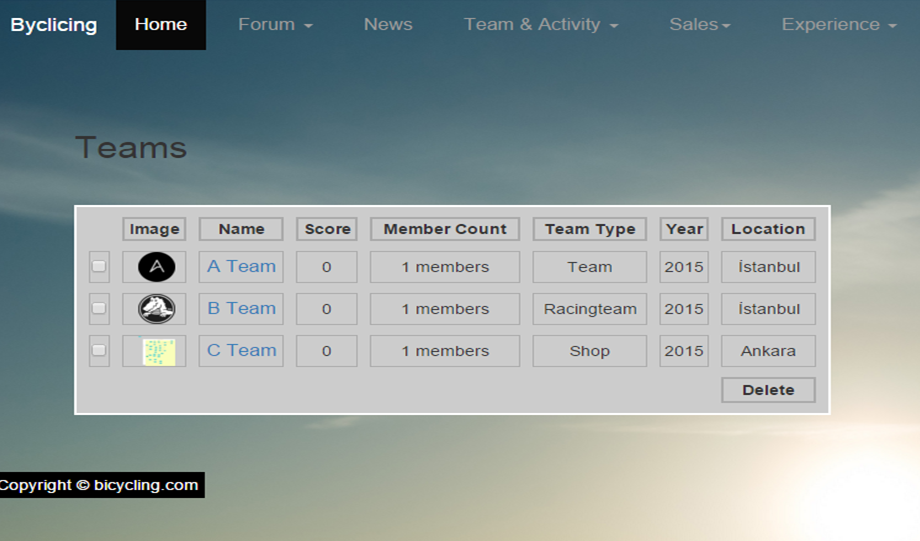
--

  * Update Team

    Any information belongs to this team can be updated by its founder.

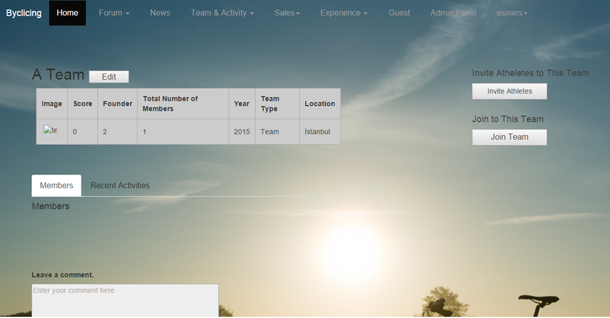
--

  * Delete Team

    A team can be deleted by its owner. To delete a team, checkbox should be selected next to the name of the team.

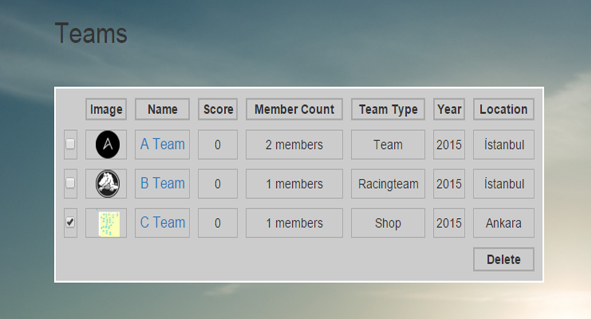
--

  * Search Team

    A team can be searched by its name or its location.

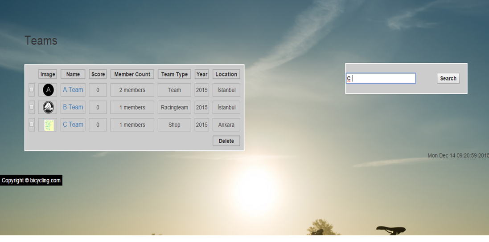
--

  * Join Team

    Other members can join any team with clicking to the 'Join Team' button. When a user clicks to this button, this team's ID is inserted to the current user's TEAMID information into the members table.

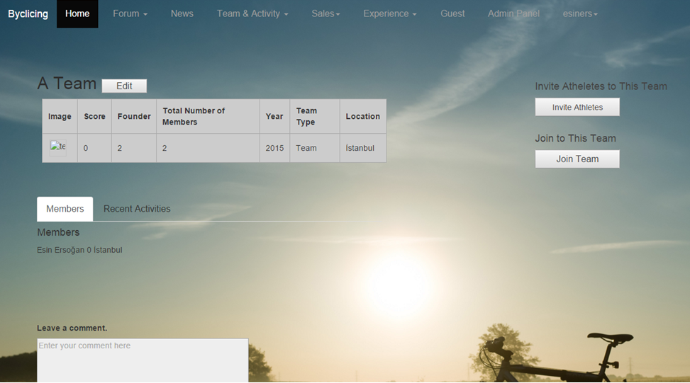
--

Race Pages
----------
  Race class has adding, editing, deleting, search, and join this race operations.

  * Add Race Operation:

    A race can be added with filling the below form. Race type is selected from the options served with an dropdown menu.
  Race place is selected from the cycroute options that are composed of routes added by admin served with an dropdown menu.
  The current user's ID is selected by his/her username from the user session to assign a participant to this race
  and the current race's ID is selected to insert to the RACE_RESULTS table as a row composed of this user's ID and this race's ID.

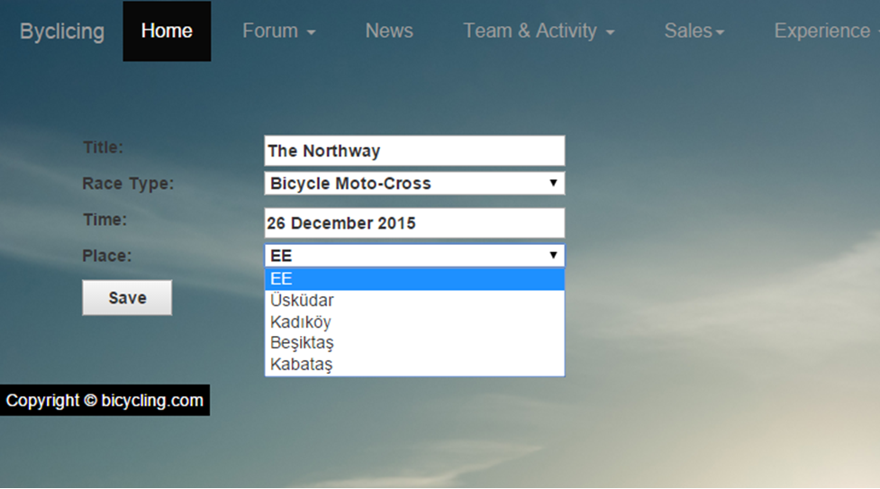
--

  * List Race

    All races can be listed just like below.

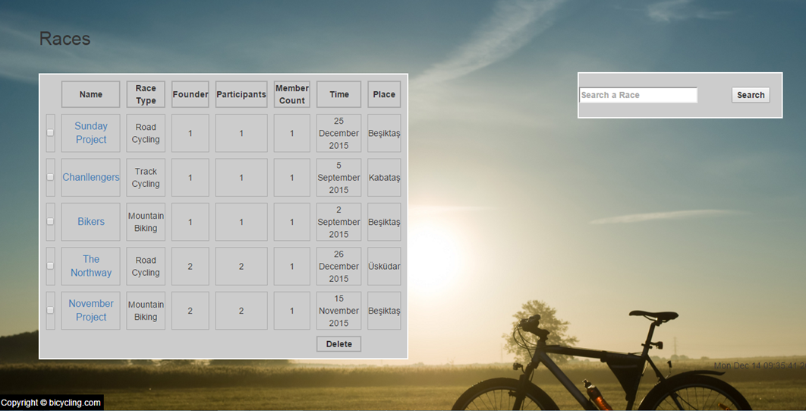
--

  * Update Race

    Any information belongs to this race can be updated by its founder.

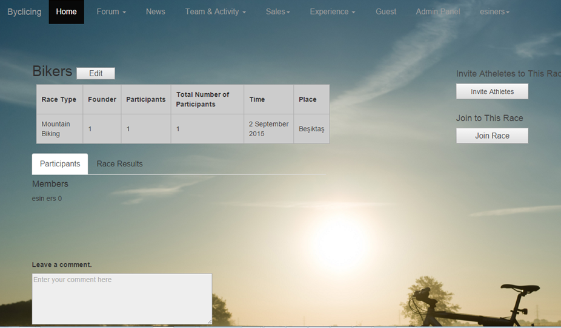
--

  * Delete Race

    A race can be deleted by its owner. To delete a race, checkbox should be selected next to the name of the race.

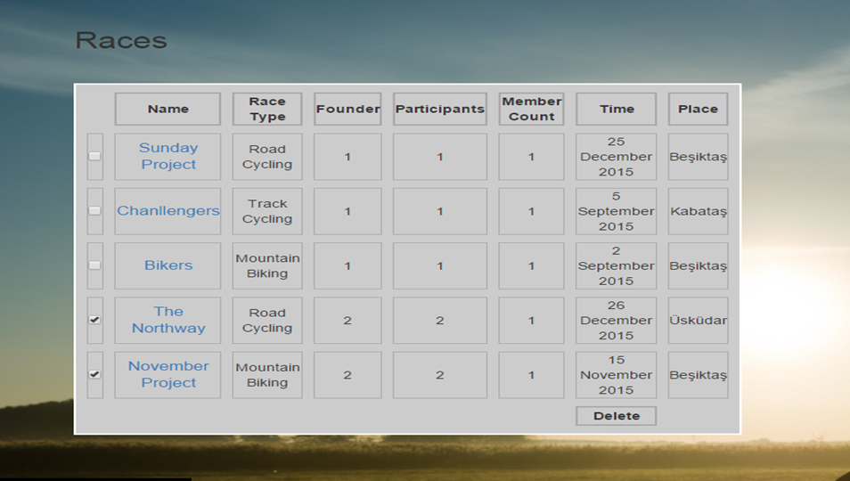
--

  * Search Race

    A race can be searched by its name or type of the race.

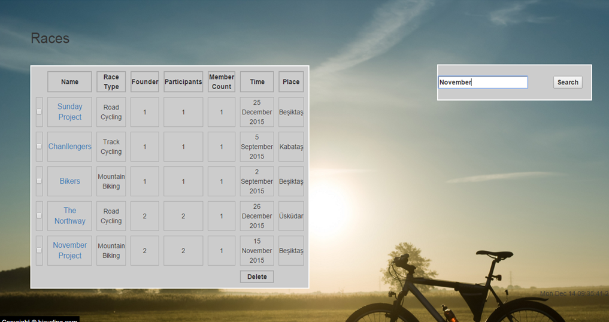
--

  * Join Race

    Other members can join any race with clicking to the 'Join Race' button.
    When a user clicks to this button, this race's ID and the   current user's ID is inserted to the RACE_RESULTS table.

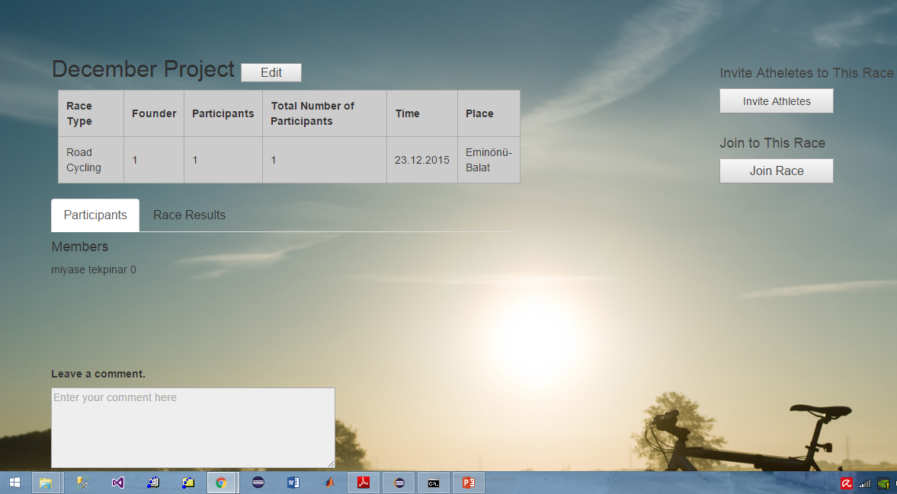
--

Activity Pages
--------------
  Race class has adding, editing, deleting, search, and join this activity operations.

  * Add Activity Operation:

    A activity can be added with filling the below form. Activity type is selected from the options served with an dropdown menu.
  The current user's ID is selected by his/her username from the user session to assign a participant to this activity
  and the current activity's ID is selected to insert to the ACTIVITY_MEMBERS table as a row composed of this user's ID and this        activity's ID.

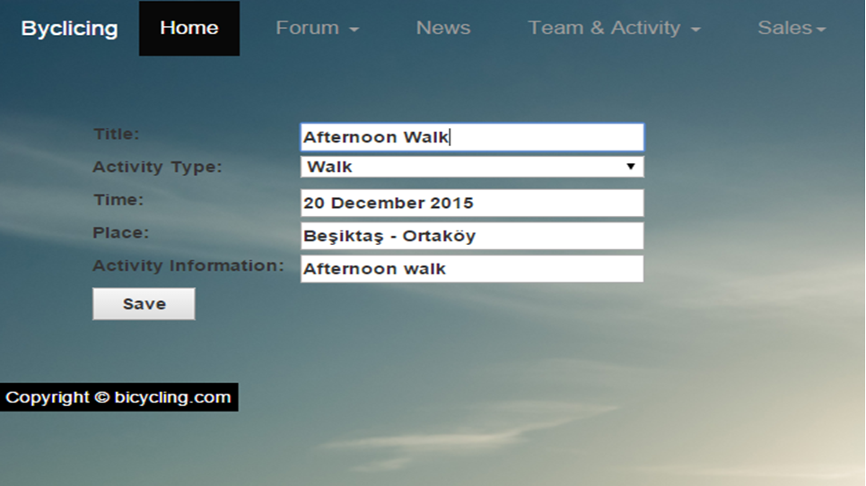
--

  * List Activity

    All activities can be listed just like below.

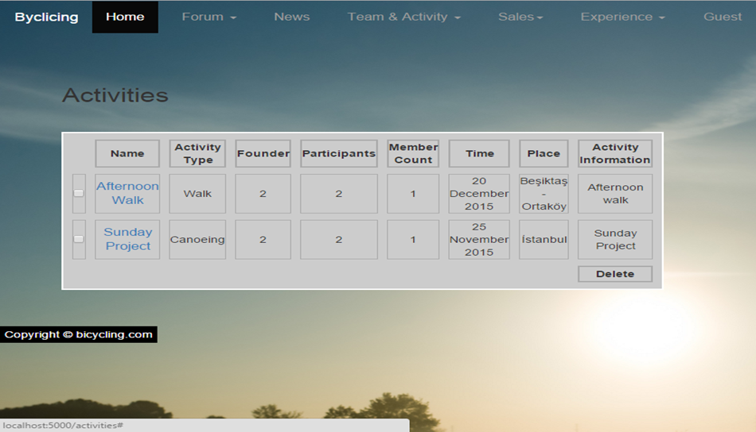
--

  * Update Activity

    Any information belongs to this activity can be updated by its founder.

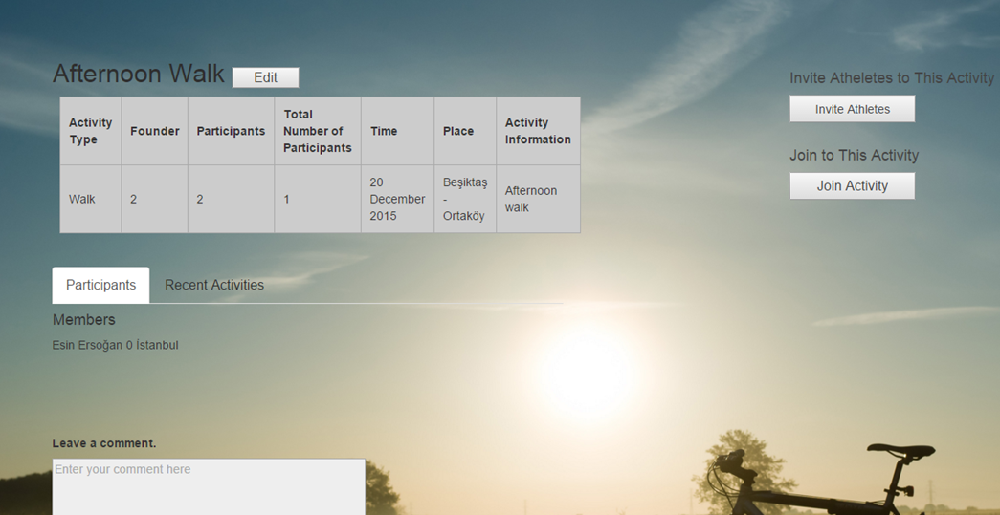
--

  * Delete Activity

    A activity can be deleted by its owner. To delete a activity, checkbox should be selected next to the name of the activity.

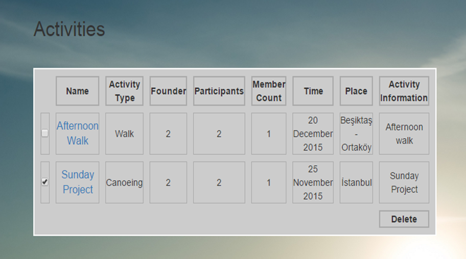
--

  * Search Activity

    A activity can be searched by its name or type of the activity.

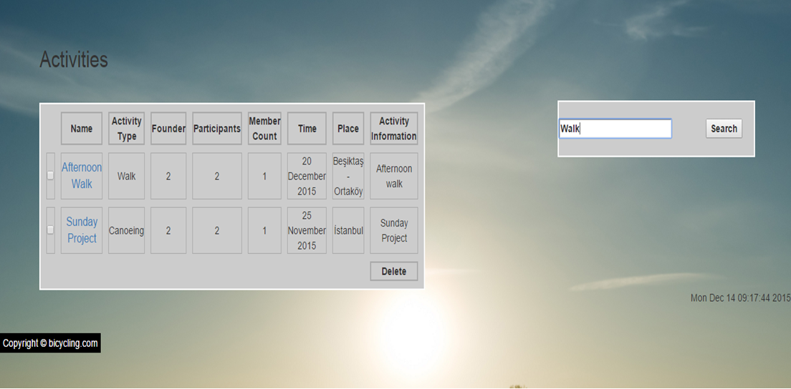
--

  * Join Activity

    Other members can join any activity with clicking to the 'Join Activity' button. When a user clicks to this button, this activity'     s ID and the current user's ID is inserted to the ACTIVITY_MEMBERS table.

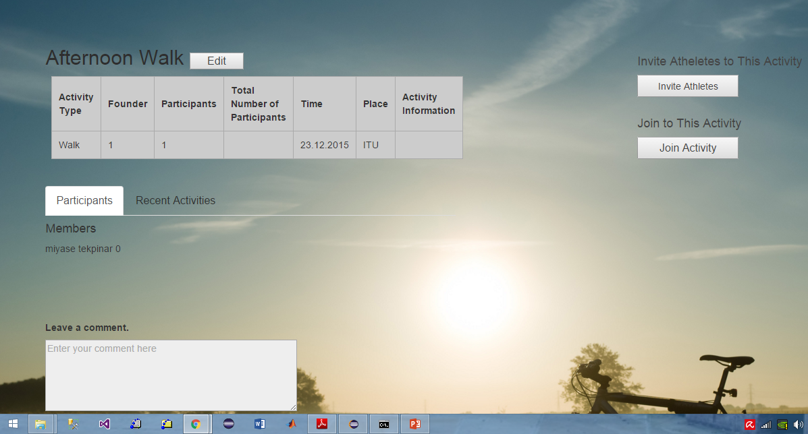
--
