Parts Implemented by Zehra ÖZER
===============================
Category Pages
--------------
-Category class has adding, editing, deleting, search operations.

 * Add category operation:

    Users can add new category title and related field.

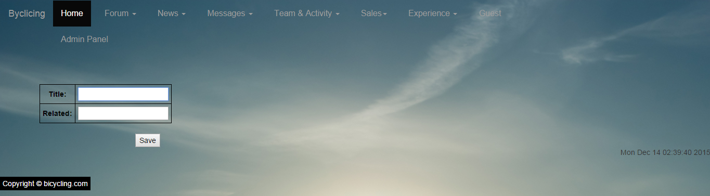
--

 * List Category

    All categories can be listed like below.

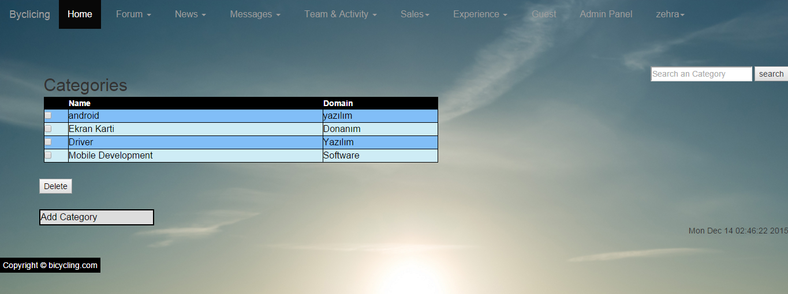
--

 * Update Category

    Any information belongs to this category can be updated.

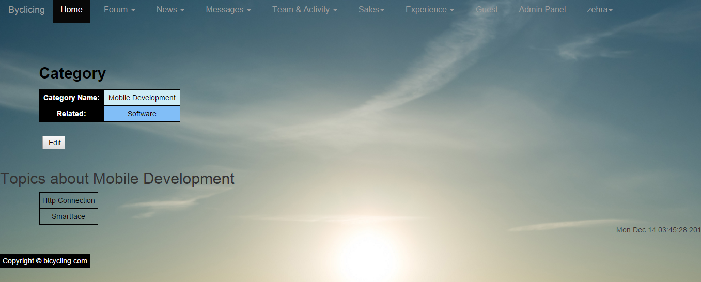
--

 * Delete Category

    To delete a category, checkbox should be selected next to the title of the category.

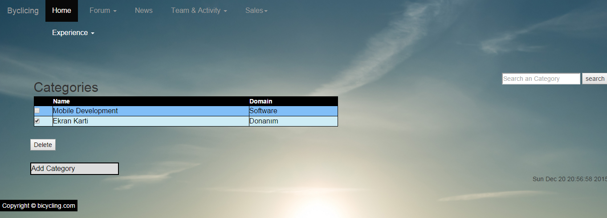
--
 
 * Search Category

    A category can be searched by its title or its field.

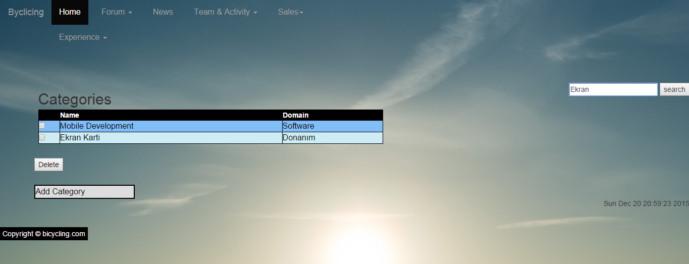
--

Announcement Pages
------------------
-Announcement class has adding, editing, deleting, search operations.

 * Add announcement operation:

    Only admin can add new announcement. The for include title and content.

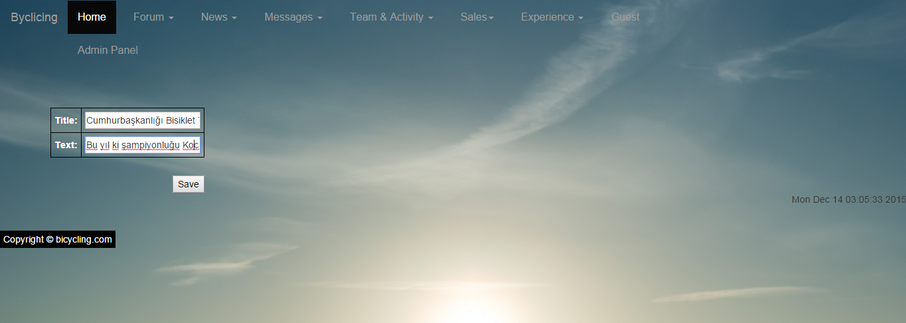
--

 * List Announcement

    All announcements can be listed like below.

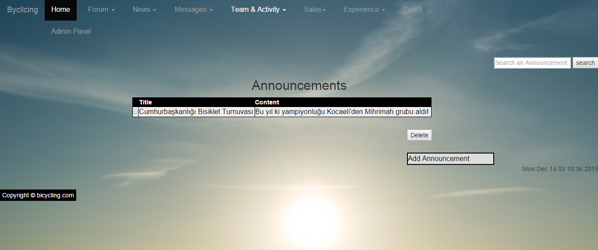
--

 * Update Announcement

    Any information belongs to this announcement can be updated.

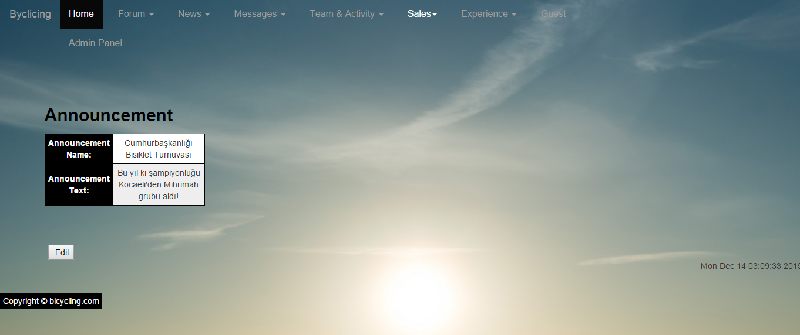
--

 * Delete Announcement

    To delete an announcement, checkbox should be selected next to the title of the announcement.

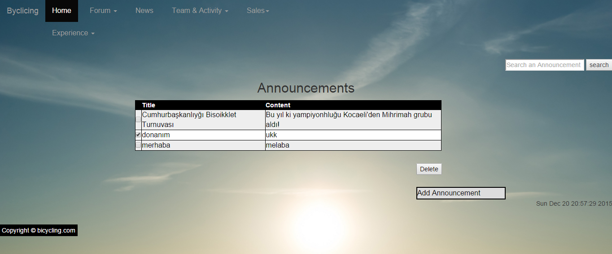
--

 * Search Announcement

    An announcement can be searched by its title or its content.

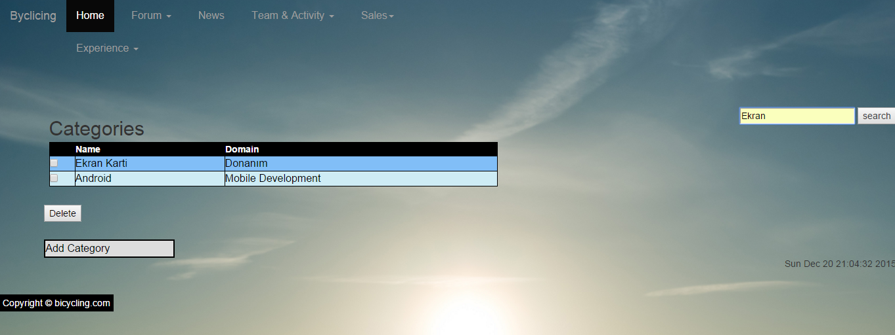
--

Topic Pages
-----------
-Topic class has adding, editing, deleting, search operations.

 * Add topic operation:

    Users can add new topic title, content and related category.
    User select category from dropdown list of categories.

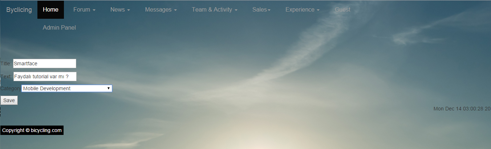
--

 * List Topic

    All topics can be listed like below.

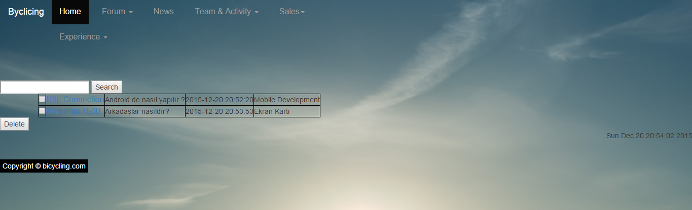
--

 * Update Topic

    Any information belongs to this topic can be updated.

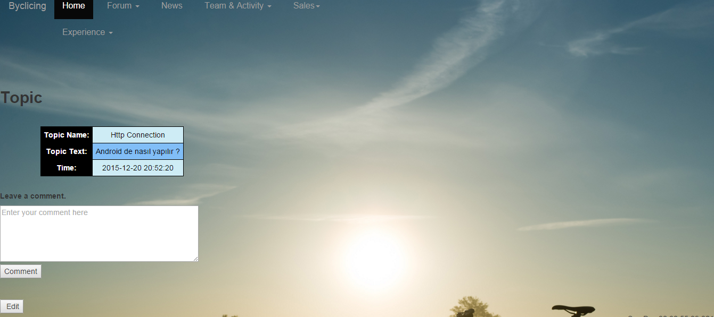
--

 * Delete Topic

    To delete a topic, checkbox should be selected next to the title of the topic.

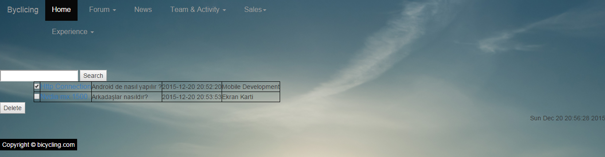
--

 * Search Topic

    A topic can be searched by its title or its content.

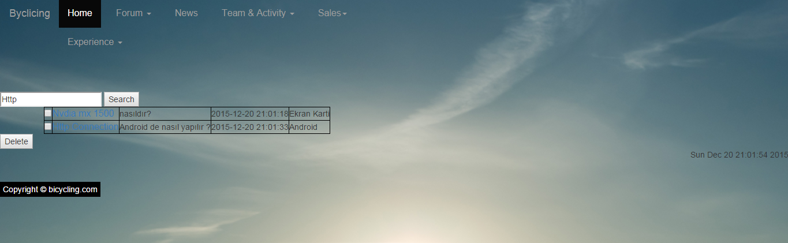
--
